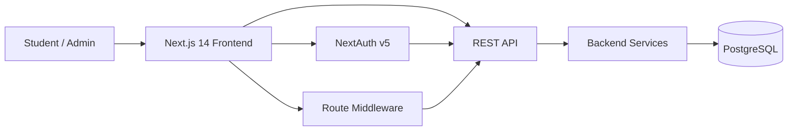

<div align="center">
  

  # MyNIT — Intelligent Course Registration Frontend

  **A modern, responsive course-registration assistant for university students.**

  <p dir="rtl"><strong>سامانه هوشمند انتخاب واحد دانشگاه صنعتی نوشیروانی بابل</strong></p>

  
  
  
  
  
  

  <br />

  [Features](#-features) •
  [Architecture](#-architecture) •
  [Getting Started](#-getting-started) •
  [Environment Variables](#-environment-variables) •
  [Limitations](#current-limitations)
</div>

---

## 📖 About the Project

**MyNIT** is the frontend of an intelligent university course-registration system designed to make academic planning faster, clearer, and less error-prone.

Instead of forcing students to manually inspect curriculum charts, prerequisites, class times, exam times, and possible timetable combinations, the application brings these tasks into one responsive interface. It provides academic-history visualization, recommended curriculum charts, manual and automatic weekly planners, conflict detection, course-data import, and administrative student-management tools.

This repository contains the **frontend application**. It communicates with a separate REST API for authentication, academic data, course selection, timetable generation, and administration.

> The project was developed as the frontend component of a bachelor's thesis focused on the design and implementation of an intelligent course-registration assistant.

---

## ✨ Features

### 🎓 Student Experience

- **Registration and sign-in** using student credentials.
- **Academic history** for previous and current semesters.
- **University curriculum chart** showing the suggested academic path.
- **Intelligent suggested chart** based on the student's remaining courses.
- **Responsive Persian/RTL interface** for desktop and mobile devices.
- Clear loading, error, validation, and toast-feedback states.

### 🗓️ Manual Pre-Registration Planner

Students can build their preferred timetable interactively before registration.

The planner includes:

- Course selection by category.
- Prevention of duplicate course selection.
- **Automatic class-time conflict detection**.
- **Automatic exam-time conflict detection**.
- Visual weekly timetable generation.
- Selected-course and selected-exam summaries.
- Submission of the chosen course set to the backend.
- Export of the course list as **Excel (`.xlsx`)**.
- Export of the timetable as a high-resolution **PNG image**.

### 🧠 Automatic Weekly Planner

Students can select the courses they want and ask the system to generate possible weekly schedules.

- Generates multiple compatible timetable alternatives through the backend.
- Requires a minimum selected workload before generation.
- Supports browsing generated plans with pagination.
- Displays each generated plan as a visual weekly schedule.
- Allows the generated result set to be reset and regenerated.

### 📥 Academic Data Import

Because direct integration with the university's educational system is not always available, the frontend includes a semi-automatic import workflow.

- Accepts copied HTML table data (`<tbody>...</tbody>`).
- Parses the data locally in the browser.
- Normalizes table rows and columns.
- Displays the parsed result in an MUI Data Grid for review.
- Shows row/column statistics before submission.
- Uploads the verified raw academic data to the backend.

### 🛡️ Authentication & Route Protection

- Authentication powered by **NextAuth v5** with a credentials provider.
- JWT-based session strategy.
- Backend access token stored in the authenticated session.
- Axios request interceptors automatically attach the bearer token.
- Middleware protects authenticated student routes.
- Dedicated protection for `/admin` and nested admin routes.
- Backend token validation through the `/authorize` endpoint.
- Input validation with **Zod**.

### 👨‍💼 Administration

The admin interface provides tools for managing student records.

- View registered students.
- Search and sort student records.
- Open detailed academic information for an individual student.
- Inspect previous/current term information.
- Delete student records through a confirmation flow.
- Admin-only route authorization.

---

## 🧱 Architecture

The frontend uses the **Next.js App Router** and a component-oriented architecture. Interactive pages primarily run on the client, while Next.js server capabilities are used where authentication and server-side actions are appropriate.



At the broader system level, the project report describes a three-layer architecture consisting of:

1. **Frontend** — Next.js + React
2. **Backend** — FastAPI services
3. **Database** — PostgreSQL

The frontend communicates with the backend through REST endpoints and keeps presentation concerns separated from application/business logic handled by backend services.

---

## 🛠️ Tech Stack

| Area | Technologies |
| --- | --- |
| Framework | Next.js 14.1.2, React 18 |
| Language | TypeScript 5 |
| UI | Material UI, MUI X Data Grid, Tailwind CSS, Emotion |
| Animation | Framer Motion |
| Server State | React Query v3 |
| Client State | Zustand |
| HTTP | Axios |
| Authentication | NextAuth v5 beta |
| Forms | React Hook Form |
| Validation | Zod |
| Notifications | React Hot Toast |
| Icons | MUI Icons, Lucide React, React Icons |
| RTL Support | Stylis + `stylis-plugin-rtl` |
| Image Export | html2canvas |
| Excel Export | SheetJS (`xlsx`) |
| Font | Vazirmatn |
| Code Quality | ESLint, Prettier |

---

## 🚀 Getting Started

### Prerequisites

Make sure you have:

- **Node.js 18.17+**
- **npm**
- A running backend API compatible with the endpoints used by this frontend

### 1. Clone the repository

```bash
git clone https://github.com/Amirali-Nrp/MyNit-Frontend-Remastered.git
cd MyNit-Frontend-Remastered
```

### 2. Install dependencies

Because the repository includes `package-lock.json`, the recommended installation command is:

```bash
npm ci
```

For normal dependency installation you can also use:

```bash
npm install
```

### 3. Configure the environment

Create a `.env.local` file in the project root:

```env
NEXT_PUBLIC_API_URL=http://localhost:8000
AUTH_SECRET=YOUR_44_CHARACTER_AUTH_SECRET
```

Generate a compatible 44-character secret with:

```bash
openssl rand -base64 33
```

Update `NEXT_PUBLIC_API_URL` to match your backend address.

### 4. Start the development server

```bash
npm run dev
```

Open:

```text
http://localhost:3000
```

---

## 🔐 Environment Variables

| Variable | Required | Description |
| --- | :---: | --- |
| `NEXT_PUBLIC_API_URL` | ✅ | Base URL of the backend REST API. |
| `AUTH_SECRET` | ✅ | NextAuth secret. The current Zod schema requires exactly 44 characters. |
| `NODE_ENV` | Automatic | `development`, `production`, or `test`. Defaults to `development`. |

> Do not commit `.env.local` or production secrets to version control.

---

## 📜 Available Scripts

| Command | Description |
| --- | --- |
| `npm run dev` | Starts the Next.js development server. |
| `npm run build` | Creates a production build. |
| `npm run start` | Starts the production server after a successful build. |
| `npm run lint` | Runs the project's Next.js lint command. |

### Production

```bash
npm run build
npm run start
```

---

## 🗺️ Application Routes

| Route | Purpose | Access |
| --- | --- | --- |
| `/` | Landing page | Public |
| `/login` | Student/admin login | Public |
| `/register` | Account registration | Public |
| `/dashboard` | Main authenticated area | Authenticated |
| `/terms` | Previous and current semesters | Authenticated |
| `/suggestedUniversityChart` | University suggested curriculum | Authenticated |
| `/suggestedSystemChart` | Intelligent remaining-course chart | Authenticated |
| `/weeklyPlanner` | Manual pre-registration planner | Authenticated |
| `/autoWeeklyPlanner` | Automatic timetable generation | Authenticated |
| `/addCourses` | Import academic data | Authenticated |
| `/admin` | Student management | Admin |
| `/admin/studentInfo/[id]` | Detailed student information | Admin |

---

<a id="current-limitations"></a>
## ⚠️ Current Limitations

The current implementation has a few important limitations:

- Direct integration with the university's Golestan system is not available, so academic information is currently imported through copied table HTML.
- The recommendation approach described in the project report is currently **rule-based**, rather than machine-learning based.
- Some mobile views can still benefit from further UI and performance optimization.

---

## 🔭 Possible Future Improvements

- Direct synchronization with Golestan through an official API or a reliable automated integration layer.
- More advanced filtering by course day and time.
- Machine-learning-based personalized course recommendations.
- Enhanced analytics dashboards for academic administrators.
- Better mobile optimization for complex curriculum and planner views.
- Expanded automated test coverage.
- Dockerized development/deployment workflow.
- API schema documentation and generated client types.

---

## 🤝 Contributing

Contributions, bug reports, and improvement suggestions are welcome.

A typical contribution workflow is:

```bash
git checkout -b feature/your-feature
git add .
git commit -m "feat: describe your change"
git push origin feature/your-feature
```

Then open a pull request describing:

- What changed.
- Why the change is needed.
- How it was tested.
- Screenshots for UI changes, when applicable.

---

## 🎓 Academic Context

This project was developed as the frontend implementation of a bachelor's thesis titled approximately:

> **Design and Implementation of an Intelligent Student Course-Registration Assistant — Frontend**

The work focuses on improving the university course-registration experience through modern frontend architecture, intelligent academic-planning features, timetable conflict prevention, and a more accessible user interface.

---

## 📄 License

This project is licensed under the **MIT License**.

See the [LICENSE](./LICENSE) file for details.

---

<div align="center">
  <strong>Built to make course registration less stressful, more visual, and more intelligent.</strong>
</div>
